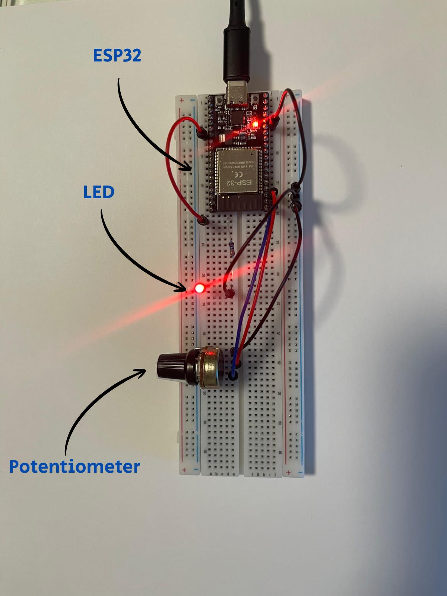
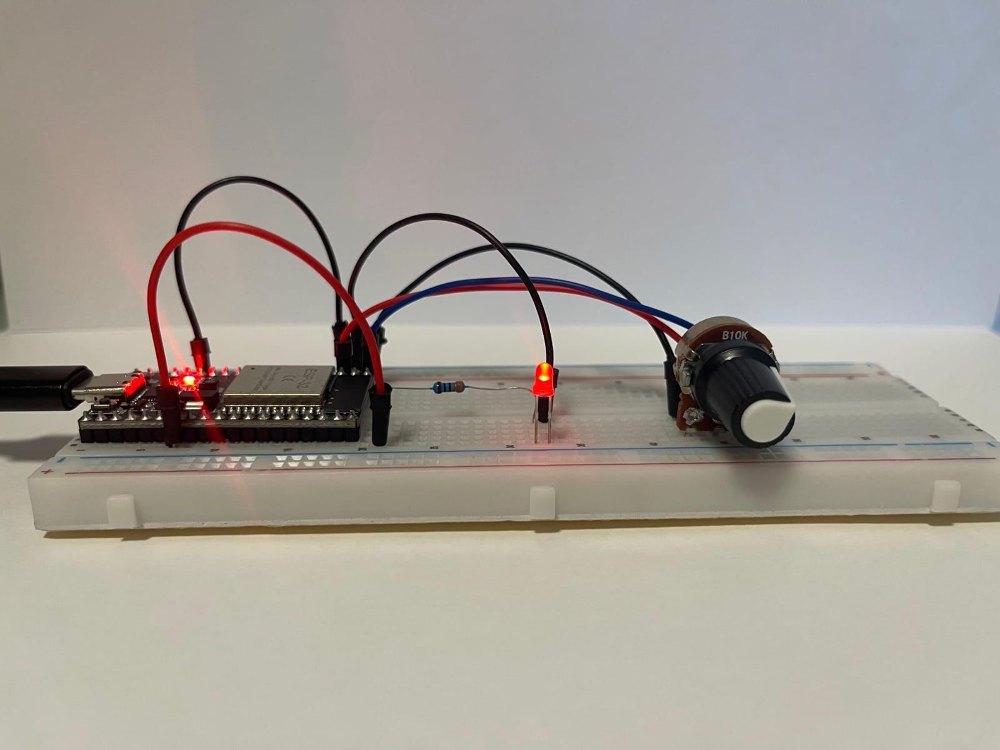

# LED brightness control
LED brightness control project using ESP32, CLI, potentiometer, PWM and RTOS.

## Features
- The system is controlled by RTOS.
- CLI controls the system status (ON/OFF).
- A timer controls the potentiometer readings.
- When the system is OFF, the LED will be turned off, and the timer stops.
- The readings from the potentiometer are mapped to the PWM's range (0-255).
- `cli_task` reads characters from the terminal with UART connection.
- The task accepts the following words: `off`, `Off`, `OFF`, `on`, `On`, `ON`.
- ON turns the system ON, OFF turns it OFF
- Any other word will trigger the `help` message, which clarifies
  the acceptable words.
- If the system is already ON/OFF when entering ON/OFF, the user will be notified.
- Max characters to enter - 63, after the 63rd character, the `cli_task` won't read any other character.
- As soon as the system is turned ON, a new reading will occur.
- In case the timer won't stop/start, an infinite loop will occur, which triggers the watchdog.

## 📽️ Demo

### 🎞️ GIF 1 – CLI Example

### 🎞️ GIF 2 – Brightness Control Example

---

### 📸 Project Images

  
   
  <em>LED Brightness Control breadboard – top view</em>

  
   
  <em>LED Brightness Control breadboard – front view</em>

## Installation
- Clone this repository:  
  git clone https://github.com/GoldmanLiyam/led-brightness-control.git
- Open with VS CODE and PlatformIO extension
- Connect ESP32 board
- Upload code via PlatformIO

## Usage
- `on` - Turn system ON  
- `off` - Turn system OFF  
- Any other word - Show help message

## Hardware
- ESP32 DevKit v1
- 10kΩ potentiometer
- 3mm, 3V LED
- 330Ω resistor
- Breadboard & jumpers

## License
This project is licensed under the MIT License - see the [LICENSE](LICENSE) file for details.

Created by Liyam Goldman

